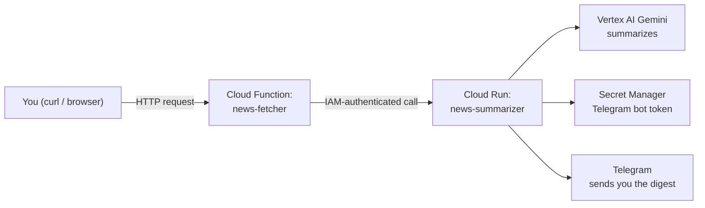

# Module 14 – Deploying AI Applications

**Duration:** 4 hrs
**Goal:** Every module so far has run on your own machine. This module is where that changes — you'll take a real, working AI pipeline and put it on the internet, running on Google's infrastructure, callable from anywhere, on a schedule or on demand.

> **This module's story continues directly into Module 15 – Event-Driven AI Applications** (the next branch in this repo, `15-event-driven-ai-applications`, which builds on this one). The Daily News Digest Bot built here is HTTP-triggered only, on purpose — Module 15 is where it learns to wake itself up automatically (Pub/Sub, Eventarc, Cloud Scheduler, Cloud Tasks, API Gateway).

## What we're building: a Daily News Digest Bot

Two small agents, each deployed a different way, working together:

- **`news-fetcher`** (Cloud Function) — a lightweight function that pulls today's headlines from a free RSS feed. No heavy dependencies, runs for a few seconds, perfect for a Cloud Function.
- **`news-summarizer`** (Cloud Run, a Docker container) — takes those headlines, asks Gemini to summarize them, and sends the result to your personal Telegram via a bot. Needs more setup (Vertex AI SDK, Secret Manager access) — a good fit for a full container.

By the end, you'll have a genuinely useful personal tool: hit one URL, and a friendly news digest shows up in your Telegram a few seconds later.

**Trigger note:** this module deliberately uses a plain HTTP call to trigger the pipeline, not a schedule. Cloud Scheduler and event-driven triggers are Module 15's actual subject (Event-Driven AI Applications) — wiring that up here would be teaching ahead of that module.

## Topics (in teaching order)

| # | Topic | What it builds |
|---|-------|------------------|
| 1 | [Docker](01-docker.md) | Package `news-summarizer` into a container, test it locally |
| 2 | [Artifact Registry](02-artifact-registry.md) | Store that container image on GCP |
| 3 | [Cloud Run](03-cloud-run.md) | Deploy `news-summarizer` as a live service |
| 4 | [Cloud Functions](04-cloud-functions.md) | Deploy `news-fetcher`, calling the Cloud Run service |
| 5 | [Secret Manager](05-secret-manager.md) | Store the Telegram bot token securely |
| 6 | [IAM](06-iam.md) | Grant each service exactly the access it needs — and watch the pipeline finally work end to end |
| 7 | [Environment Variables](07-environment-variables.md) | Change behavior (chat ID, RSS feed) without rebuilding anything |

## A deliberate teaching choice: things will fail on purpose, in order

The pipeline is built up piece by piece, and it will **not** work end-to-end until topic 6. That's intentional:

- After topic 3, calling `news-summarizer` fails — the Telegram secret doesn't exist yet (topic 5's job).
- After topic 4, calling `news-fetcher` fails — it's not authorized to invoke `news-summarizer` yet (topic 6's job).
- After topic 5, calling `news-summarizer` fails differently — the secret exists now, but the service isn't allowed to read it yet.
- After topic 6, everything finally connects, and a real Telegram message arrives.

Each failure is real, informative, and specific to the topic that fixes it — a much better teaching moment than everything working perfectly from the first deploy.

## Cost note

This is the first deployment-heavy module in the course, and the good news is it's essentially free: Cloud Run and Cloud Functions each have an Always Free tier of 2 million requests/invocations per month, Artifact Registry includes 0.5 GB of free storage, and Secret Manager includes 6 free active secret versions and 10,000 free access operations monthly. Nothing here needs the provision-then-tear-down discipline that Cloud SQL and Redis needed back in Module 9.

## Prerequisites before starting

- Modules 2 and 3 complete
- Docker Desktop installed and running
- A free Telegram bot token (created via [@BotFather](https://t.me/BotFather) — covered step by step in topic 5) and your personal Telegram chat ID
- `.env` filled in (see `.env.example` at this module's root)

## What you'll be able to do after this module

Take any small Python AI service, containerize it, host that container's image properly, deploy it as a real running service, wire up secure service-to-service calls with least-privilege permissions, and manage its secrets and config the right way — the full path from "works on my machine" to "works on the internet."
