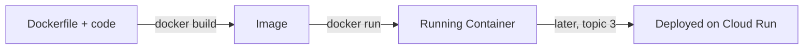

# 1. Docker

## What Is It? (Plain English)

Docker packages your app — code, dependencies, runtime, everything it needs — into one portable box called a **container**. That box runs identically on your laptop, a teammate's laptop, or a Google Cloud server, because it's not relying on anything installed outside itself.

## Why It Matters for AI Engineers

"It works on my machine" is a real problem the moment you deploy anything. Your `news-summarizer` service needs Python, the `google-genai` SDK, Flask, and specific versions of all of them — Docker guarantees Cloud Run sees exactly the same setup you tested locally.

## Key Concepts

| Term | Meaning |
|------|---------|
| **Image** | The built, packaged version of your app — a snapshot, not yet running |
| **Container** | A running instance of an image |
| **`Dockerfile`** | The recipe describing how to build the image, step by step |
| **`docker build`** | Turns a `Dockerfile` + your code into an image |
| **`docker run`** | Starts a container from an image |

## How It Fits Together



## Step-by-Step: Build and Test `news-summarizer` Locally

**1. Look at the Dockerfile** (`news_summarizer/Dockerfile`):
```dockerfile
FROM python:3.11-slim
WORKDIR /app
COPY requirements.txt .
RUN pip install --no-cache-dir -r requirements.txt
COPY main.py .
CMD exec gunicorn --bind :$PORT --workers 1 --threads 8 --timeout 60 main:app
```
Each line: start from a small Python base image, set the working folder, install dependencies, copy the app code, then define how to actually run it (`gunicorn`, a real production server — not Flask's built-in dev server).

**2. Build the image:**
```bat
cd news_summarizer
docker build -t news-summarizer-local .
```

**3. Run it locally** — the tricky part: the container needs to call Vertex AI and Secret Manager, which normally uses your `gcloud` login. Mount just your Application Default Credentials file into the container:
```bat
docker run --rm -p 8080:8080 ^
  --env-file ..\.env ^
  -e PORT=8080 ^
  -e GOOGLE_APPLICATION_CREDENTIALS=/tmp/keys/adc.json ^
  -v "%APPDATA%\gcloud\application_default_credentials.json:/tmp/keys/adc.json:ro" ^
  news-summarizer-local
```

**4. Test it** (in a second Command Prompt window):
```bat
curl -X POST -H "Content-Type: application/json" ^
  -d "{\"headlines\": [\"Test headline one\", \"Test headline two\"]}" ^
  http://localhost:8080/
```

## Common Pitfalls

- Forgetting the ADC credential mount — the container will fail to authenticate to any GCP service, with a confusing error rather than an obvious "not logged in" one.
- Using Flask's built-in dev server (`app.run()`) as the actual production command — fine for local testing, wrong for anything deployed; that's exactly why the `Dockerfile` uses `gunicorn`.
- Not rebuilding the image after changing `main.py` — `docker build` needs to run again; the running container doesn't see live code edits.
- Forgetting `-e PORT=8080` on `docker run` — the `Dockerfile`'s `CMD` binds to `$PORT`. Cloud Run sets that automatically once deployed, but a plain local `docker run` doesn't, and gunicorn fails to start without it.

## Quick Recap

1. What's the difference between an image and a container?
2. Why can't the container just automatically use your local `gcloud` login?
3. Why does the `Dockerfile` run `gunicorn` instead of Flask's own dev server?
