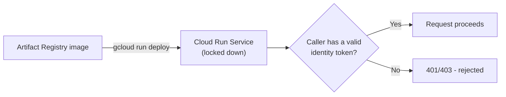

# 3. Cloud Run

## What Is It? (Plain English)

Cloud Run takes a container image and turns it into a live, callable service with a real URL — fully managed, scales to zero when nobody's calling it, scales up automatically when traffic arrives.

## Why It Matters for AI Engineers

This is how `news-summarizer` actually goes live. It's also where we make a deliberate security choice: deploy it **locked down** (`--no-allow-unauthenticated`), so only callers with the right permission can reach it — not the entire internet.

## Key Concepts

| Term | Meaning |
|------|---------|
| **Service** | One deployed Cloud Run app, identified by a URL |
| **`--no-allow-unauthenticated`** | Requires a valid identity token on every request — nothing gets in for free |
| **Revision** | Each deploy creates a new, versioned revision; traffic can be split or rolled back between them |
| **Scale to Zero** | No traffic, no running instances, no charge — part of why this module is effectively free |

## How It Fits Together



## Step-by-Step

**1. Deploy from the image pushed in topic 2:**
```bat
gcloud run deploy %SUMMARIZER_SERVICE_NAME% ^
  --image=%REGION%-docker.pkg.dev/%PROJECT_ID%/%REPO_NAME%/news-summarizer:v1 ^
  --region=%REGION% ^
  --no-allow-unauthenticated ^
  --service-account=%SUMMARIZER_SA_EMAIL% ^
  --set-env-vars=PROJECT_ID=%PROJECT_ID%,LOCATION=%REGION%,TELEGRAM_CHAT_ID=%TELEGRAM_CHAT_ID%,SECRET_NAME=%SECRET_NAME%
```

**2. Get the service URL:**
```bat
gcloud run services describe %SUMMARIZER_SERVICE_NAME% --region=%REGION% --format="value(status.url)"
```

**3. Test it, authenticated as yourself:**
```bat
for /f %%i in ('gcloud auth print-identity-token') do set ID_TOKEN=%%i
curl -X POST -H "Authorization: Bearer %ID_TOKEN%" -H "Content-Type: application/json" ^
  -d "{\"headlines\": [\"Test headline one\", \"Test headline two\"]}" ^
  <SERVICE_URL_FROM_STEP_2>
```

## Expect this to fail right now — on purpose

The request will authenticate fine but fail with a "secret not found" error — `TELEGRAM_BOT_TOKEN` doesn't exist in Secret Manager yet. That's topic 5. This isn't a mistake to fix right now; it's the module's deliberate build-it-up-in-order teaching approach (see the module overview).

## Common Pitfalls

- Deploying with `--allow-unauthenticated` "to make testing easier" — defeats the whole point of this topic; keep it locked down and use identity tokens to test, exactly like a real caller would need to.
- Forgetting the service URL includes no trailing path — POST straight to the root URL.
- Panicking at the "secret not found" error instead of recognizing it as expected at this point in the module.

## Quick Recap

1. What does `--no-allow-unauthenticated` actually require from a caller?
2. What happens to a Cloud Run service's cost when nothing is calling it?
3. Why does testing the service right now fail, and is that a real problem?
