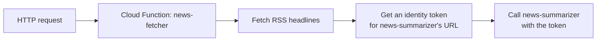

# 4. Cloud Functions

## What Is It? (Plain English)

Cloud Functions runs a single, small piece of code in response to a trigger — no Dockerfile, no container to build, just a function and its dependencies. It's the lighter-weight alternative to Cloud Run, for workloads that don't need a full container.

## Why It Matters for AI Engineers

`news-fetcher` is a perfect fit: it does one small thing (fetch an RSS feed, forward the headlines) and doesn't need Vertex AI, Secret Manager, or any heavy dependency. Deploying it as a full container would be unnecessary ceremony — a function is the right-sized tool.

## Key Concepts

| Term | Meaning |
|------|---------|
| **Gen 2 Functions** | The current generation, built on Cloud Run under the hood — longer timeouts, more control than Gen 1 |
| **`functions_framework`** | The library that turns a plain Python function into an HTTP-triggered service |
| **Entry Point** | The specific function name Cloud Functions calls when a request arrives |
| **Identity Token** | How `news-fetcher` proves to Cloud Run's IAM check that it's allowed to call `news-summarizer` |

## How It Fits Together



## Step-by-Step

**1. Look at the code** (`news_fetcher/main.py`) — it fetches headlines, then calls `google.oauth2.id_token.fetch_id_token()` to get a token scoped specifically to the summarizer's URL before calling it.

**2. Deploy:**
```bat
cd news_fetcher
gcloud functions deploy %FETCHER_FUNCTION_NAME% ^
  --gen2 ^
  --runtime=python311 ^
  --region=%REGION% ^
  --source=. ^
  --entry-point=fetch_and_forward ^
  --trigger-http ^
  --no-allow-unauthenticated ^
  --service-account=%FETCHER_SA_EMAIL% ^
  --set-env-vars=RSS_FEED_URL=%RSS_FEED_URL%,SUMMARIZER_URL=%SUMMARIZER_URL%
```

**3. Test it:**
```bat
for /f %%i in ('gcloud auth print-identity-token') do set ID_TOKEN=%%i
curl -X GET -H "Authorization: Bearer %ID_TOKEN%" <FUNCTION_URL>
```

## Expect this to fail right now — differently than topic 3 did

You'll see a `403 Forbidden` — not from your own call (that part succeeds), but from Cloud Run rejecting the function's attempt to call `news-summarizer`. The function's service account isn't authorized to invoke it yet. That's topic 6. Same deliberate pattern as topic 3's failure — a real, specific, informative error.

## Common Pitfalls

- Confusing this 403 with a code bug — the code is correct; the *permission* is what's missing, and permissions are topic 6's job.
- Forgetting `SUMMARIZER_URL` has to be the real URL from topic 3's deploy — copy it exactly, no trailing slash mismatch.
- Deploying without `--gen2` — Gen 1 functions have real limitations (shorter timeouts, less control) that Gen 2 removes.
- Using Google News's `/rss/search` URL as your feed — Google blocks that specific endpoint's traffic from Google Cloud's own egress IPs with a 503 bot-detection page. It works fine from your laptop and fails only once deployed, which makes it a confusing one to debug. Use a different public RSS feed (any works — this module defaults to a TechCrunch tag feed).

## Quick Recap

1. Why is a Cloud Function a better fit for `news-fetcher` than a full Cloud Run container?
2. What does `fetch_id_token()` actually get, and what is it scoped to?
3. Why does calling `news-fetcher` fail right now, and what will fix it?
