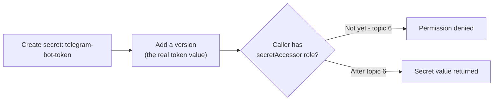

# 5. Secret Manager

## What Is It? (Plain English)

Secret Manager stores sensitive values — API keys, tokens, passwords — securely and separately from your code and your deploy commands. Nothing sensitive ever sits in plain text in a script or an environment variable flag.

## Why It Matters for AI Engineers

The Telegram bot token is a real credential — anyone who has it can send messages as your bot. It has no business living in `main.py`, in a `--set-env-vars` flag (which shows up in `gcloud` logs and deploy history), or in this course's git history. Secret Manager is where it actually belongs.

## Key Concepts

| Term | Meaning |
|------|---------|
| **Secret** | A named container for sensitive values (e.g., `telegram-bot-token`) |
| **Secret Version** | Each time you update a secret's value, it creates a new version — old ones stay recoverable |
| **Access Control** | Reading a secret requires an explicit IAM grant (topic 6) — it isn't open just because the secret exists |

## How It Fits Together



## Step-by-Step: Get a Telegram Bot Token First

1. Open Telegram, search for **@BotFather**, start a chat
2. Send `/newbot`, follow the prompts (choose a name and a username ending in `bot`)
3. BotFather replies with your bot token — a string like `123456789:ABCdefGhIJKlmNoPQRsTUVwxyz`
4. To get your **chat ID**: message your new bot anything, then visit `https://api.telegram.org/bot<YOUR_TOKEN>/getUpdates` in a browser — your chat ID is in the JSON response under `message.chat.id`

## Step-by-Step: Store the Token in Secret Manager

**1. Create the secret:**
```bat
gcloud secrets create %SECRET_NAME% --replication-policy=automatic
```

**2. Add the actual token as a version** (never type the real token directly into a command you might screenshot or share — paste it interactively when prompted, or use a local file you don't commit):
```bat
echo %TELEGRAM_BOT_TOKEN% | gcloud secrets versions add %SECRET_NAME% --data-file=-
```

**3. Confirm it's there (without printing the value):**
```bat
gcloud secrets versions list %SECRET_NAME%
```

## Retry calling `news-summarizer` now — the error changes

Same request as topic 3. Before, it failed with "secret not found." Now it fails with **"permission denied"** instead — the secret exists, but `news-summarizer`'s service account isn't allowed to read it yet. That shift in error message is the whole point of this topic: existence and access are two separate things. Topic 6 grants the access.

## Common Pitfalls

- Putting the token in `--set-env-vars` instead of Secret Manager "just for now" — this is exactly the habit this topic exists to break.
- Typing the real secret value directly into a command that ends up in shell history or a screen recording — pipe it in instead, as shown above.
- Assuming a secret is automatically readable by whatever's calling it — it never is; every reader needs an explicit grant.

## Quick Recap

1. Why shouldn't the Telegram token be a plain environment variable?
2. What's a secret version, and why does that matter?
3. What specifically changes about the error message after this topic, compared to topic 3, and why?
