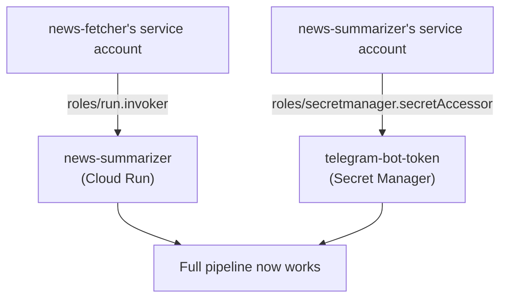

# 6. IAM

## What Is It? (Plain English)

Same concept as Module 2's IAM topic — who's allowed to do what — now applied to two deployed services instead of a human user. This is the topic that finally makes the whole pipeline work.

## Why It Matters for AI Engineers

Every failure so far in this module (topic 3's "secret not found," topic 4's "403 Forbidden," topic 5's "permission denied") has been IAM doing its job correctly — refusing access that wasn't explicitly granted. This topic is where you grant exactly the two permissions actually needed, nothing more.

## Key Concepts

| Term | Meaning |
|------|---------|
| **`roles/secretmanager.secretAccessor`** | Lets a principal read a secret's value — granted to `news-summarizer`'s service account |
| **`roles/run.invoker`** | Lets a principal call a locked-down Cloud Run service — granted to `news-fetcher`'s service account |
| **Least Privilege** | Each grant maps to exactly one real need — no broader "just in case" roles |

## How It Fits Together



## Step-by-Step

**1. Grant `news-summarizer` access to the secret:**
```bat
gcloud secrets add-iam-policy-binding %SECRET_NAME% ^
  --member="serviceAccount:%SUMMARIZER_SA_EMAIL%" ^
  --role="roles/secretmanager.secretAccessor"
```

**2. Grant `news-fetcher` permission to invoke `news-summarizer`:**
```bat
gcloud run services add-iam-policy-binding %SUMMARIZER_SERVICE_NAME% ^
  --region=%REGION% ^
  --member="serviceAccount:%FETCHER_SA_EMAIL%" ^
  --role="roles/run.invoker"
```

**3. Run the full pipeline — for real, this time:**
```bat
for /f %%i in ('gcloud auth print-identity-token') do set ID_TOKEN=%%i
curl -X GET -H "Authorization: Bearer %ID_TOKEN%" <FETCHER_FUNCTION_URL>
```

Check your Telegram — a real digest should arrive within a few seconds.

## Common Pitfalls

- Granting `roles/editor` or `roles/owner` to make the errors "just go away" — every earlier topic's failure had one specific, narrow fix; use it, not a broad one.
- Granting the binding on the wrong resource (e.g., project-level instead of the specific secret/service) — always scope IAM bindings to the smallest resource that makes sense.
- Forgetting service accounts need the binding on the *resource being accessed*, not on themselves — the secret needs to know who can read it; the Cloud Run service needs to know who can invoke it.

## Quick Recap

1. What two IAM roles does this topic grant, and to which service account each?
2. Why is granting `roles/editor` the wrong fix here, even though it would technically work?
3. What changes about the pipeline's behavior the moment both bindings are in place?
