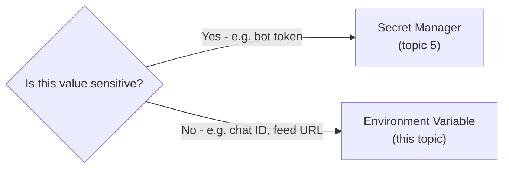

# 7. Environment Variables

## What Is It? (Plain English)

Environment variables are non-sensitive configuration — values that change how a service behaves without needing to touch code or rebuild anything. `TELEGRAM_CHAT_ID` and `RSS_FEED_URL` both live here.

## Why It Matters for AI Engineers

Not everything configurable is a secret. The Telegram chat ID isn't sensitive the way the bot token is — there's no harm if someone sees it, it just needs to be *correct*. Knowing which bucket a value belongs in (Secret Manager vs. environment variable) is a real, recurring decision.

## Key Concepts

| Term | Meaning |
|------|---------|
| **Environment Variable** | A key-value pair available to your running service, set at deploy time |
| **`--set-env-vars`** | Sets env vars during a `gcloud run deploy` / `gcloud functions deploy` |
| **`--update-env-vars`** | Changes env vars on an *already-deployed* service — no rebuild, no new image |

## How It Fits Together



## Step-by-Step: Change Config Without Rebuilding

**Update the summarizer's env vars on the already-deployed service:**
```bat
gcloud run services update %SUMMARIZER_SERVICE_NAME% ^
  --region=%REGION% ^
  --update-env-vars=TELEGRAM_CHAT_ID=%NEW_CHAT_ID%
```

**Update the fetcher's RSS feed the same way:**
```bat
gcloud functions deploy %FETCHER_FUNCTION_NAME% ^
  --gen2 --region=%REGION% ^
  --update-env-vars=RSS_FEED_URL=%NEW_RSS_FEED_URL%
```

For the Cloud Run service: no `docker build`, no `docker push`, no new image — the exact same image reference stays deployed, just with new configuration, live within seconds.

**This doesn't hold for the Cloud Function.** `gcloud functions deploy` (source-based) re-triggers Cloud Build on *every* deploy, including an env-var-only change — it produces a new image digest each time, even though no code changed. The env var change still takes effect with no code edits needed, which is this topic's real point; just don't expect "zero build" for the Cloud Functions half specifically.

## Common Pitfalls

- Putting something sensitive here "because it's easier than Secret Manager" — revisit topic 5's reasoning; ease isn't the deciding factor, sensitivity is.
- Forgetting `--update-env-vars` only *adds or changes* variables — use `--remove-env-vars` to actually delete one, or `--set-env-vars` to replace the entire set at once.
- Hardcoding a value in `main.py` that should have been an env var from the start — anything you'd want to change without a redeploy belongs here.
- Assuming "no rebuild" applies equally to both services — it's genuinely true for `gcloud run services update`, not for `gcloud functions deploy` (see above).

## Quick Recap

1. What's the deciding factor between "this belongs in Secret Manager" and "this belongs in an environment variable"?
2. What does `--update-env-vars` let you avoid doing?
3. Name one value in this module's pipeline that's an env var, and explain why it isn't a secret.
