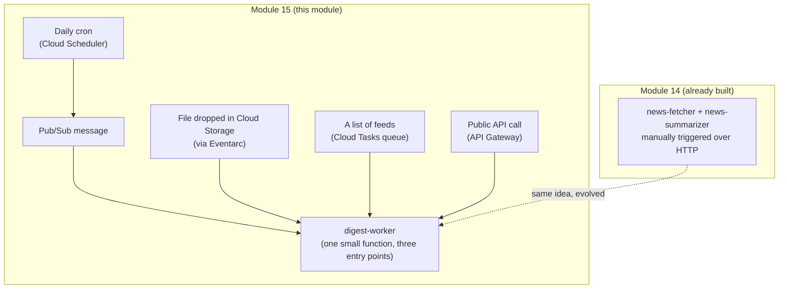

# Module 15 – Event-Driven AI Applications

**Duration:** 3 hrs
**Goal:** Module 14 taught you to deploy an AI service. This module teaches it to **wake itself up** — automatically, on a schedule, in response to a file landing somewhere, from a queue, or through a proper public API — instead of you manually pinging it every time.

## Directly continues Module 14 — same story, same worker, five new triggers

Module 14 built the **Daily News Digest Bot** and deliberately left one thing unfinished: *"Cloud Scheduler and event-driven triggers are Module 15's actual subject — wiring that up here would be teaching ahead of that module."* This is that module.

The code here is **rebuilt fresh** (no imports from the Module 14 branch, per the course's isolation rule) as one small worker — **`digest-worker`** — that fetches a news feed, summarizes it with Gemini, and sends it to Telegram. Same job as Module 14's `news-summarizer`, simplified into a single Cloud Function since this module's actual focus is *what triggers it*, not re-teaching Docker/Cloud Run.

## One worker, five ways to wake it up

| # | Topic | How it triggers `digest-worker` |
|---|-------|-----------------------------------|
| 1 | [Pub/Sub](01-pub-sub.md) | Publish a message to a topic → a subscribed function runs |
| 2 | [Eventarc](02-eventarc.md) | Drop a `feeds.txt` file into a Cloud Storage bucket → an event-triggered function runs automatically |
| 3 | [Cloud Scheduler](03-cloud-scheduler.md) | A daily cron job publishes to the same Pub/Sub topic — the literal "still ahead" piece from Module 14 |
| 4 | [Cloud Tasks](04-cloud-tasks.md) | Given several feeds, one reliable, retryable, rate-controlled task per feed |
| 5 | [API Gateway](05-api-gateway.md) | A public, API-key-protected front door — no GCP-specific auth needed |

## Why this isn't one giant tangled pipeline

Each topic triggers the *same* worker independently — this module deliberately avoids chaining all five into one dependency-heavy flow. That keeps every topic demoable and understandable on its own, while still living in one familiar, continuous story.

## Cost note

Confirmed against Google's current pricing: Pub/Sub (10 GiB/month free), Cloud Scheduler (3 free jobs/month per billing account — this module needs 1), Cloud Tasks (1 million free operations/month), and API Gateway (2 million free calls/month) all comfortably cover this module's usage. Eventarc has no separate charge beyond its Pub/Sub transport layer. Same free-tier-friendly profile as Module 14.

## Prerequisites before starting

- Module 14 complete (the concepts — Cloud Functions, IAM, Secret Manager, environment variables — are assumed, not re-taught)
- A Telegram bot token and chat ID (same one from Module 14, or a fresh one — either works)
- `.env` filled in (see `.env.example` at this module's root)

## What you'll be able to do after this module

Take any deployed AI service and wire it to start automatically — from a message, a file, a clock, a queue, or a public API — and know which of the five triggering patterns actually fits a given situation, instead of defaulting to "just call it over HTTP" for everything.
