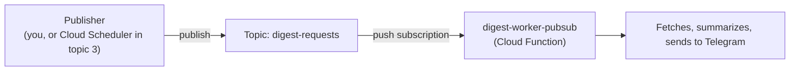

# 1. Pub/Sub

## What Is It? (Plain English)

Pub/Sub is a message board. A **publisher** posts a message to a **topic**, without knowing or caring who (if anyone) is listening. A **subscriber** listens to that topic and reacts when a message arrives. Publisher and subscriber never talk to each other directly.

## Why It Matters for AI Engineers

This is the foundation of decoupled systems: whoever fetches news doesn't need to know anything about who summarizes it, or how many things react to "new headlines are ready." You could add a second subscriber later (an email digest, a logging service) without touching the publisher at all.

## Key Concepts

| Term | Meaning |
|------|---------|
| **Topic** | The named channel messages get published to |
| **Publisher** | Anything that sends a message to a topic |
| **Subscription** | A registered listener on a topic — this is what actually delivers messages somewhere |
| **Push Subscription** | GCP delivers the message *to* your service (e.g., triggers a Cloud Function) — what this topic uses |
| **Fire-and-Forget** | Publishing doesn't wait for or expect a response — the "result" is whatever the subscriber does |

## How It Fits Together



## Step-by-Step

**1. Create the topic:**
```bat
gcloud pubsub topics create %TOPIC_NAME%
```

**2. Deploy `digest-worker` with a Pub/Sub trigger** (Gen 2 functions use Eventarc under the hood for this — more on that distinction in topic 2):
```bat
gcloud functions deploy digest-worker-pubsub ^
  --gen2 --runtime=python311 --region=%REGION% --source=digest_worker ^
  --entry-point=on_pubsub_message ^
  --trigger-topic=%TOPIC_NAME% ^
  --service-account=%WORKER_SA_EMAIL% ^
  --set-env-vars=PROJECT_ID=%PROJECT_ID%,LOCATION=%LOCATION%,TELEGRAM_CHAT_ID=%TELEGRAM_CHAT_ID%,SECRET_NAME=%SECRET_NAME%
```

**3. Grant the auto-created push subscription permission to invoke the function** — with no separate trigger service account specified, the Eventarc/Pub/Sub push subscription behind a Gen 2 trigger authenticates *as the function's own runtime service account*, so that account needs `run.invoker` on itself:
```bat
gcloud run services add-iam-policy-binding digest-worker-pubsub ^
  --region=%REGION% ^
  --member="serviceAccount:%WORKER_SA_EMAIL%" ^
  --role="roles/run.invoker"
```

**4. Publish a test message:**
```bat
gcloud pubsub topics publish %TOPIC_NAME% --message="{\"feed_url\": \"https://techcrunch.com/tag/artificial-intelligence/feed/\"}"
```

**5. Check your Telegram** — a digest should arrive within a few seconds.

## Common Pitfalls

- Expecting `gcloud pubsub topics publish` to return the subscriber's result — it never does; that's what "fire-and-forget" means.
- Sending malformed JSON in the message body — the function's `on_pubsub_message` expects a JSON payload with a `feed_url` key; check Cloud Logging if nothing happens.
- Forgetting a topic can have *multiple* subscriptions — useful to know, even though this module's demo uses just one.
- Using a Google News `/rss/search` URL as `feed_url` — Google blocks that specific endpoint's traffic from Google Cloud's own egress IPs with a 503 bot-detection page (confirmed in Module 14). Any other public RSS feed works — this module defaults to a TechCrunch tag feed.
- Skipping step 3's `run.invoker` grant — the deploy succeeds and publishing "works" (no error from `gcloud pubsub topics publish`, since publishing is fire-and-forget), but nothing ever arrives in Telegram. Logs show repeated `IAM principal lacks {run.routes.invoke} permission` — the push subscription itself needs this grant, not just a human caller.

## Quick Recap

1. Does a publisher know who (or how many subscribers) will receive its message?
2. What does "push subscription" mean, specifically?
3. If you wanted to add a second reaction to new headlines later, what would you need to change about the publisher?
