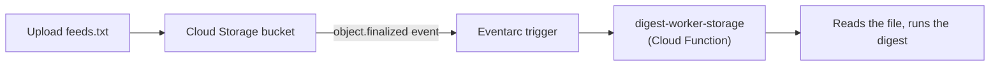

# 2. Eventarc

## What Is It? (Plain English)

Eventarc routes events from Google Cloud services themselves — a file landing in a bucket, a Firestore document changing — directly to a service, without you writing any polling code or manually publishing anything.

## Why It Matters for AI Engineers

Topic 1 needed *someone* to publish a message. This topic needs *nobody* — GCP already knows a file was uploaded; Eventarc just routes that fact to your function. This topic uses Cloud Storage as the event source: drop a `feeds.txt` file into a bucket, and `digest-worker` runs automatically.

## Key Concepts

| Term | Meaning |
|------|---------|
| **Event Source** | The GCP service generating the event — Cloud Storage, in this topic |
| **Trigger** | The Eventarc rule connecting a specific event type to a specific destination |
| **`object.finalized`** | The Cloud Storage event fired when a new object upload completes |
| **Eventarc and Pub/Sub, related but distinct** | Pub/Sub-triggered Gen 2 functions actually run on Eventarc under the hood — Eventarc's real distinguishing feature is routing many *kinds* of events, not just Pub/Sub messages |

## How It Fits Together



## Step-by-Step

**1. Create the bucket** (bucket names are globally unique across all of GCP — if this one's taken, pick another):
```bat
gcloud storage buckets create gs://%FEEDS_BUCKET_NAME% --location=%REGION%
```

**2. Let the Cloud Storage service agent notify Eventarc** (one-time per project — without it, step 4's deploy fails with "Failed to update storage bucket metadata"):
```bat
for /f %%i in ('gcloud storage service-agent --project=%PROJECT_ID%') do set GCS_AGENT=%%i
gcloud projects add-iam-policy-binding %PROJECT_ID% ^
  --member="serviceAccount:%GCS_AGENT%" ^
  --role="roles/pubsub.publisher"
```

**3. Let the trigger's own service account receive Eventarc events** (must happen *before* the deploy below — the deploy itself fails with "Permission eventarc.events.receiveEvent denied" without it):
```bat
gcloud projects add-iam-policy-binding %PROJECT_ID% ^
  --member="serviceAccount:%WORKER_SA_EMAIL%" ^
  --role="roles/eventarc.eventReceiver"
```

**4. Deploy `digest-worker` with an Eventarc trigger on that bucket:**
```bat
gcloud functions deploy digest-worker-storage ^
  --gen2 --runtime=python311 --region=%REGION% --source=digest_worker ^
  --entry-point=on_storage_event ^
  --trigger-event-filters="type=google.cloud.storage.object.v1.finalized" ^
  --trigger-event-filters="bucket=%FEEDS_BUCKET_NAME%" ^
  --service-account=%WORKER_SA_EMAIL% ^
  --set-env-vars=PROJECT_ID=%PROJECT_ID%,LOCATION=%LOCATION%,TELEGRAM_CHAT_ID=%TELEGRAM_CHAT_ID%,SECRET_NAME=%SECRET_NAME%
```

**5. Let the trigger's push subscription invoke this function** (same underlying pattern as topic 1 — the push subscription authenticates as the function's own runtime SA):
```bat
gcloud run services add-iam-policy-binding digest-worker-storage ^
  --region=%REGION% ^
  --member="serviceAccount:%WORKER_SA_EMAIL%" ^
  --role="roles/run.invoker"
```

**6. Let the worker actually read files from the bucket** (separate from receiving the event notification — the worker's code calls `blob.download_as_text()`, which needs its own grant):
```bat
gcloud storage buckets add-iam-policy-binding gs://%FEEDS_BUCKET_NAME% ^
  --member="serviceAccount:%WORKER_SA_EMAIL%" ^
  --role="roles/storage.objectViewer"
```

**7. Upload a `feeds.txt` file** (one feed URL per line):
```bat
echo https://techcrunch.com/tag/artificial-intelligence/feed/ > feeds.txt
gcloud storage cp feeds.txt gs://%FEEDS_BUCKET_NAME%/feeds.txt
```

**8. Check your Telegram** — no `gcloud pubsub publish`, no direct call, just an upload.

## Common Pitfalls

- Uploading to the wrong bucket — the trigger is scoped to one specific bucket name; a typo means silence, not an error.
- Expecting *any* file event to fire it — this trigger is filtered to `object.finalized` specifically (a completed upload), not partial uploads or deletes.
- Assuming Eventarc replaces Pub/Sub entirely — they overlap (Eventarc uses Pub/Sub as its transport for some event types) but solve different problems: "route this GCP event" vs. "let me publish an app-level message."
- Skipping any of steps 2, 3, 5, or 6 — each is a real, separate IAM grant this exact setup needs: the GCS service agent needs to *publish* the event, the worker SA needs to *receive* it, the push subscription needs to *invoke* the function, and the worker SA separately needs to *read* the actual file. Missing any one produces a different, specific failure (a failed deploy, a silently-failing trigger, or a 403 reading the file) rather than one generic "it doesn't work."

## Quick Recap

1. What triggers `digest-worker-storage`, and who (or what) has to do anything to make it fire?
2. What Cloud Storage event does this topic filter on?
3. How is Eventarc related to Pub/Sub, and how is it different?
