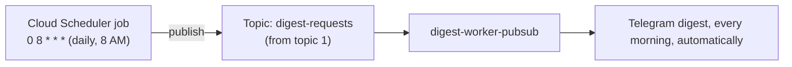

# 3. Cloud Scheduler

## What Is It? (Plain English)

Cloud Scheduler is a managed cron job — it rings on a schedule you define, and something happens. That's it. This is the piece Module 14 explicitly promised was coming.

## Why It Matters for AI Engineers

"Get my news every morning at 8 AM" is exactly what a personal AI assistant should do without you lifting a finger. Cloud Scheduler is how any of this module's triggers becomes something that runs on its own, forever, on a timer.

## Key Concepts

| Term | Meaning |
|------|---------|
| **Job** | One scheduled task — a schedule plus a target |
| **Cron Expression** | The schedule syntax, e.g. `0 8 * * *` = every day at 8:00 AM |
| **Target** | What the job actually triggers — this topic targets topic 1's Pub/Sub topic |
| **Time Zone** | Cron schedules need an explicit time zone — "8 AM" is meaningless without one |

## How It Fits Together



## Step-by-Step

**1. Create a job targeting the Pub/Sub topic from topic 1** — no new function needed, this reuses topic 1's infrastructure entirely:
```bat
gcloud scheduler jobs create pubsub morning-digest-job ^
  --schedule="0 8 * * *" ^
  --topic=%TOPIC_NAME% ^
  --message-body="{\"feed_url\": \"https://techcrunch.com/tag/artificial-intelligence/feed/\"}" ^
  --time-zone="Asia/Kolkata" ^
  --location=%REGION%
```

**2. Don't wait until tomorrow morning to test it — trigger it manually:**
```bat
gcloud scheduler jobs run morning-digest-job --location=%REGION%
```

**3. Check your Telegram.**

## Common Pitfalls

- Forgetting `--time-zone` — schedules default to UTC, which is rarely what you actually meant.
- Building a whole new function or endpoint for the scheduled job "just in case" — reusing an existing Pub/Sub topic as the target is simpler and exactly what this topic demonstrates.
- Assuming the job ran because you created it — always verify with `gcloud scheduler jobs run` (manual trigger) or check the job's execution history, don't just trust the schedule during a demo.

## Quick Recap

1. What does the cron expression `0 8 * * *` mean?
2. What does this topic's Scheduler job actually target — a function directly, or something else?
3. How do you test a scheduled job without waiting for its actual scheduled time?
