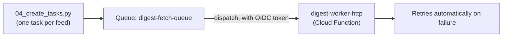

# 4. Cloud Tasks

## What Is It? (Plain English)

Cloud Tasks is a managed queue that guarantees a specific HTTP call actually happens — with automatic retries on failure and control over how fast tasks fire. Unlike Pub/Sub's "broadcast to anyone listening," Cloud Tasks targets one exact endpoint, per task.

## Why It Matters for AI Engineers

If you want `digest-worker` to process five different feeds, firing all five at once risks hitting Telegram's rate limit or overwhelming things. Cloud Tasks lets you enqueue one task per feed, each reliably delivered, retried if it fails, and paced so you don't overload anything downstream.

## Key Concepts

| Term | Meaning |
|------|---------|
| **Queue** | A named container for tasks, with its own rate-limiting and retry configuration |
| **HTTP Target Task** | A task that, when dispatched, makes an HTTP request to a specific URL |
| **OIDC Token** | How a task authenticates itself to a locked-down Cloud Function — an identity token attached per task, not a shared secret |
| **Retry** | If the target fails, Cloud Tasks automatically retries, with backoff |

## How It Fits Together



## Step-by-Step

**1. Create the queue:**
```bat
gcloud tasks queues create %QUEUE_NAME% --location=%REGION%
```

**2. Deploy `digest-worker` as an HTTP-triggered function, locked down:**
```bat
gcloud functions deploy digest-worker-http ^
  --gen2 --runtime=python311 --region=%REGION% --source=digest_worker ^
  --entry-point=on_http_request ^
  --trigger-http --no-allow-unauthenticated ^
  --service-account=%WORKER_SA_EMAIL% ^
  --set-env-vars=PROJECT_ID=%PROJECT_ID%,LOCATION=%LOCATION%,TELEGRAM_CHAT_ID=%TELEGRAM_CHAT_ID%,SECRET_NAME=%SECRET_NAME%
```

**3. Grant the task-creating service account permission to invoke it:**
```bat
gcloud run services add-iam-policy-binding digest-worker-http ^
  --region=%REGION% ^
  --member="serviceAccount:%TASKS_SA_EMAIL%" ^
  --role="roles/run.invoker"
```

**4. Grant Cloud Tasks itself permission to actually mint an OIDC token *as* that dispatcher service account** — a separate, easy-to-miss requirement from step 3. Without it, Cloud Tasks can't create a valid token in the first place, so every dispatch arrives unauthenticated and fails with the exact same "IAM principal lacks run.routes.invoke permission" error step 3 was supposed to prevent:
```bat
for /f %%i in ('gcloud projects describe %PROJECT_ID% --format="value(projectNumber)"') do set PROJECT_NUMBER=%%i
gcloud iam service-accounts add-iam-policy-binding %TASKS_SA_EMAIL% ^
  --member="serviceAccount:service-%PROJECT_NUMBER%@gcp-sa-cloudtasks.iam.gserviceaccount.com" ^
  --role="roles/iam.serviceAccountTokenCreator"
```

**5. Enqueue one task per feed** (see `04_create_tasks.py` for the full Python version, using `google.cloud.tasks_v2` with an OIDC token attached to each task):
```bat
python 04_create_tasks.py
```

## Common Pitfalls

- Confusing this with Pub/Sub — Pub/Sub doesn't guarantee delivery order or retries the same way; Cloud Tasks is specifically for "this exact call must happen, reliably, to this exact endpoint."
- Forgetting the OIDC token on each task — without it, a locked-down function will reject every dispatched task with a 403, the same lesson from Module 14's IAM topic.
- Creating unlimited tasks with no rate control in a real system — queues support rate limiting configuration for exactly this reason, worth knowing even if this demo doesn't tune it.
- Granting only step 3's `run.invoker` and assuming that's sufficient — it isn't. Step 4's `serviceAccountTokenCreator` grant (on a completely different principal — the Cloud Tasks service agent, not the dispatcher SA) is just as required; skipping it produces the identical error as skipping step 3, which makes it easy to misdiagnose as "the invoker grant didn't work" when actually a second, separate grant was just never made. Check `gcloud tasks list --queue=... ` for `lastAttemptStatus` to see the real dispatch-level error.

## Quick Recap

1. What's the core difference between Pub/Sub and Cloud Tasks?
2. What does an OIDC token attached to a task actually prove?
3. Why is Cloud Tasks a better fit than firing all five feed requests at once yourself?
