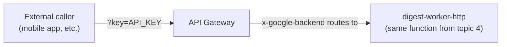

# 5. API Gateway

## What Is It? (Plain English)

API Gateway puts a proper, managed front door in front of a backend service — with a plain API key for access instead of requiring callers to have a Google Cloud identity. It's how you'd expose `digest-worker` to something that isn't part of your GCP project at all, like a mobile app or a third-party integration.

## Why It Matters for AI Engineers

Every other trigger in this module assumes the caller has a Google identity (a service account, your own `gcloud` login). That's completely wrong for a public-facing caller. API Gateway is the pattern for "let outsiders in, safely, without giving them GCP access."

## Key Concepts

| Term | Meaning |
|------|---------|
| **OpenAPI Spec** | A YAML file describing your API's paths and how they map to a backend — new artifact type for this course |
| **`x-google-backend`** | The extension telling API Gateway which real URL a path actually routes to |
| **API Config** | A specific, immutable deployment of your OpenAPI spec |
| **Gateway** | The live, running instance serving traffic according to an API Config |
| **API Key** | A plain key a caller passes as a query parameter — no Google identity required |

## How It Fits Together



## Step-by-Step

**1. Look at the OpenAPI spec** (`05_openapi_spec.yaml`) — it defines a `/trigger-digest` path, routed via `x-google-backend` to `digest-worker-http`'s URL, requiring an API key.

**2. Create the logical API and deploy a config from the spec:**
```bat
gcloud api-gateway apis create %API_ID%

gcloud api-gateway api-configs create %API_CONFIG_ID% ^
  --api=%API_ID% ^
  --openapi-spec=05_openapi_spec.yaml ^
  --backend-auth-service-account=%WORKER_SA_EMAIL%
```

**3. Deploy the gateway itself:**
```bat
gcloud api-gateway gateways create %GATEWAY_ID% ^
  --api=%API_ID% ^
  --api-config=%API_CONFIG_ID% ^
  --location=%REGION%
```

**4. Enable the API's own auto-created managed service** — a separate, easy-to-miss step from deploying the gateway itself. Without it, every call fails with `"digest-api has not been used in project ... before or it is disabled"`, even though the gateway deployed successfully:
```bat
for /f %%i in ('gcloud api-gateway apis describe %API_ID% --format="value(managedService)"') do set MANAGED_SERVICE=%%i
gcloud services enable %MANAGED_SERVICE%
```

**5. Let the backend-auth identity actually invoke the function.** `--backend-auth-service-account` in step 2 only *declares* which identity API Gateway signs its backend requests as — that identity still needs `run.invoker` on `digest-worker-http` itself, same as every other trigger in this module:
```bat
gcloud run services add-iam-policy-binding digest-worker-http ^
  --region=%REGION% ^
  --member="serviceAccount:%WORKER_SA_EMAIL%" ^
  --role="roles/run.invoker"
```

**6. Create an API key:**
```bat
gcloud services api-keys create --display-name="Digest API Key"
```
Copy the key value from the output (or `gcloud services api-keys list` + `gcloud services api-keys get-key-string KEY_ID`).

**7. Get the gateway's hostname and test it:**
```bat
gcloud api-gateway gateways describe %GATEWAY_ID% --location=%REGION% --format="value(defaultHostname)"

curl "https://GATEWAY_HOSTNAME/trigger-digest?key=YOUR_API_KEY"
```

No `gcloud auth print-identity-token` anywhere in this test — that's the entire point of this topic.

## Common Pitfalls

- Forgetting `--backend-auth-service-account` — without it, API Gateway has no identity to call the locked-down Cloud Function with, and every request fails.
- Testing without the `?key=` query parameter — the OpenAPI spec's `securityDefinitions` requires it; a request without one is rejected before it ever reaches the backend.
- Treating API Gateway and Cloud Tasks as solving the same problem — API Gateway is about *who's allowed to call in from outside*; Cloud Tasks is about *reliable delivery of calls you're making yourself*.
- Assuming `--backend-auth-service-account` alone is sufficient — it names an identity but doesn't grant that identity anything; step 5's `run.invoker` grant is still required, and skipping it produces a generic backend 403 (the exact same "Your client does not have permission" page a browser gets hitting a locked-down Cloud Run URL directly) rather than an API-Gateway-specific error.
- Skipping step 4 — a gateway can deploy successfully and still reject every call until its managed service is explicitly enabled.

## Quick Recap

1. Why doesn't this topic's test use an identity token like every earlier one did?
2. What does `x-google-backend` do inside the OpenAPI spec?
3. What would break if `--backend-auth-service-account` were left out of the api-config creation — and what would break differently if it were set but never granted `run.invoker`?
