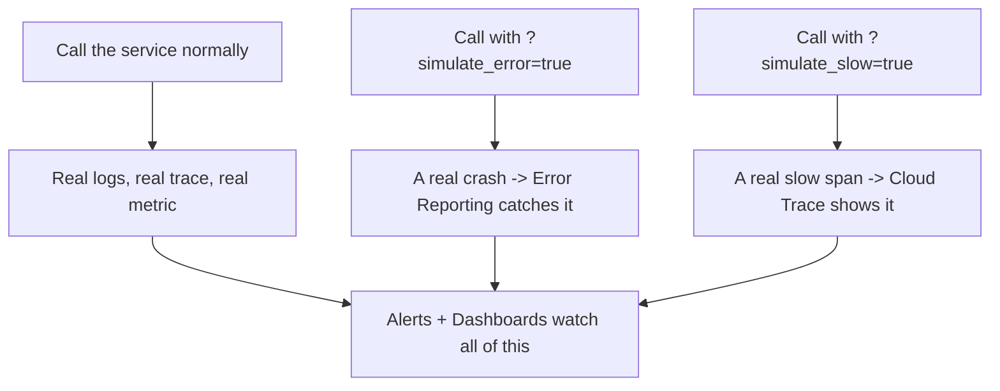

# Module 16 – Monitoring & Observability

**Duration:** 3 hrs
**Goal:** Modules 14 and 15 taught you to deploy something and trigger it automatically. This module teaches you to actually **watch it run** — see its logs, its errors, its slow spots, and get notified the moment something breaks, instead of finding out from an angry user.

## Rebuilt, not reused — same idea, one simple service, wired to fail on purpose

This module doesn't import code from Modules 14 or 15 (same isolation rule as always). It rebuilds the familiar Daily News Digest idea one more time, as **one single instrumented Cloud Run service** — not the full multi-trigger setup from Module 15, since triggering isn't this module's job.

The twist: this version has two secret switches built in on purpose —

- `?simulate_error=true` — deliberately throws a real, unhandled exception
- `?simulate_slow=true` — deliberately takes about 8 seconds to respond

**This is how real engineers actually work.** Nobody wires up monitoring and just hopes it works — you deliberately break your own system, on your own terms, to prove your logging catches it, your error tracking catches it, and your alerts actually fire. Finding out your smoke detector doesn't work during an actual fire is too late; this module is where you test the smoke detector first.

## Topics (in teaching order)

| # | Topic | What you're looking at |
|---|-------|---------------------------|
| 1 | [Cloud Logging](01-cloud-logging.md) | Structured logs from every run |
| 2 | [Cloud Monitoring](02-cloud-monitoring.md) | Built-in, automatically-collected metrics |
| 3 | [Error Reporting](03-error-reporting.md) | A real exception, automatically caught and grouped |
| 4 | [Cloud Trace](04-cloud-trace.md) | A waterfall of custom spans — where is the time actually going? |
| 5 | [Metrics](05-metrics.md) | A metric *you* define and emit yourself |
| 6 | [Alerts](06-alerts.md) | A real notification firing when something breaks |
| 7 | [Dashboards](07-dashboards.md) | Everything above, in one view |

## Cost note

Confirmed against Google's current pricing: Cloud Logging (50 GiB/month free), Cloud Monitoring (150 MiB of metrics/month free), Cloud Trace (2.5 million spans/month free), and Error Reporting (free — built on top of Logging, no separate charge). This module's usage doesn't come close to any of those limits.

## Prerequisites before starting

- Module 14 complete (Cloud Run, Secret Manager, IAM concepts are assumed, not re-taught)
- A Telegram bot token and chat ID (reuse an existing one or make a fresh one)
- `.env` filled in (see `.env.example` at this module's root)

## What you'll be able to do after this module

Instrument any deployed service with real structured logs, custom traces, and custom metrics, then prove your alerting actually works by breaking it on purpose — the same discipline real production teams use before they ever trust a system with real users.
