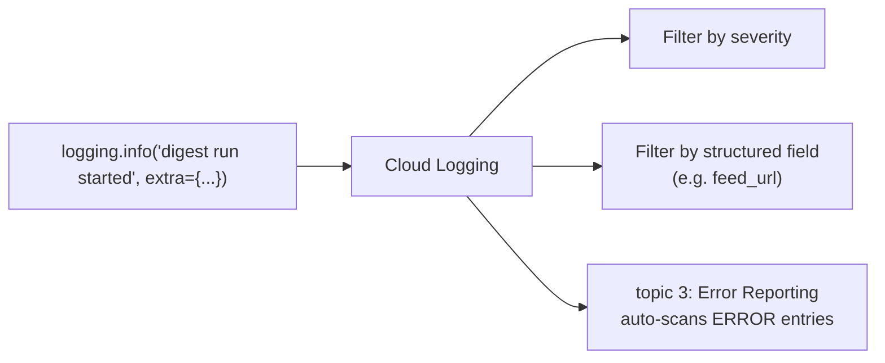

# 1. Cloud Logging

## What Is It? (Plain English)

Cloud Logging is where every log message your deployed service writes actually ends up — centralized, searchable, and structured, instead of scattered across whatever terminal happened to be open when it printed.

## Why It Matters for AI Engineers

Once something is deployed (Module 14), you can't just watch its console output live. Cloud Logging is how you find out what actually happened during a request that finished five minutes ago — which feed URL it processed, how many headlines it found, whether anything looked off.

## Key Concepts

| Term | Meaning |
|------|---------|
| **Log Entry** | One recorded event — a timestamp, a severity, a message, and structured fields |
| **Severity** | INFO, WARNING, ERROR, etc. — lets you filter noise from what actually matters |
| **Structured Logging** | Logging real fields (like `feed_url`, `headline_count`) instead of just a text sentence |
| **`setup_logging()`** | The one line that routes Python's standard `logging` calls to Cloud Logging automatically |

## How It Fits Together



## Step-by-Step

**1. The code side** — `digest_worker_observable/main.py` calls `google.cloud.logging.Client().setup_logging()` once at startup, then just uses normal Python `logging`:
```python
logging.info("digest run started", extra={"json_fields": {"feed_url": feed_url}})
```

**2. Send a normal request:**
```bat
curl "%SERVICE_URL%/?feed_url=https://techcrunch.com/tag/cloud-computing/feed/"
```

**3. View the logs:**
```bat
gcloud logging read "resource.type=cloud_run_revision AND resource.labels.service_name=%SERVICE_NAME%" --limit=20 --format=json
```
Or in the Console: **Logging → Logs Explorer**, filtered to this service.

## Common Pitfalls

- Using `print()` instead of `logging` — plain prints still get captured on Cloud Run, but lose severity levels and structured fields.
- Expecting logs the instant a request finishes — there's typically a short ingestion delay.
- Logging sensitive values (like the Telegram token) — never log secrets, even at DEBUG level.

## Quick Recap

1. What does `setup_logging()` actually connect?
2. What's the advantage of structured fields over a single text message?
3. Why shouldn't you ever log a secret value, even for debugging?
