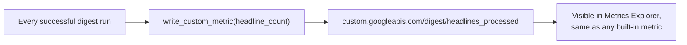

# 5. Metrics

## What Is It? (Plain English)

Topic 2 showed you metrics GCP collects automatically. This topic is about defining and writing your **own** — a number that means something specific to *your* application, that nothing built-in could give you.

## Why It Matters for AI Engineers

"How many headlines has this bot actually processed, ever?" isn't a question Cloud Run's built-in metrics can answer — request count isn't the same as headlines processed (one request might find 10 headlines, another 2). A custom metric is how you track the thing you actually care about.

## Key Concepts

| Term | Meaning |
|------|---------|
| **Custom Metric** | A metric type you define, prefixed `custom.googleapis.com/...` |
| **Time Series** | One data point (a value + a timestamp) written to a metric |
| **`create_time_series()`** | The Cloud Monitoring API call that actually writes a custom metric point |
| **Resource** | What the metric point is associated with — this module uses `global`, the simplest option |

## How It Fits Together



## Step-by-Step

**1. The code side** — `main.py`'s `write_custom_metric()` writes one point per successful run:
```python
series = monitoring_v3.TimeSeries()
series.metric.type = "custom.googleapis.com/digest/headlines_processed"
series.resource.type = "global"
# ...
# The well-known Timestamp field (end_time) must be constructed and
# assigned as a whole - it isn't mutable field-by-field like a plain
# submessage (`point.interval.end_time.seconds = ...` raises
# AttributeError: 'NoneType' object has no attribute 'seconds').
interval = monitoring_v3.TimeInterval({"end_time": {"seconds": seconds, "nanos": nanos}})
point = monitoring_v3.Point({"interval": interval, "value": {"int64_value": headline_count}})
monitoring_client.create_time_series(name=f"projects/{PROJECT_ID}", time_series=[series])
```

**2. Send a few normal requests** to generate data points:
```bat
curl %SERVICE_URL%
curl "%SERVICE_URL%/?feed_url=https://techcrunch.com/tag/cloud-computing/feed/"
```

**3. View it:** Console → **Monitoring → Metrics Explorer** → search for `headlines_processed`. Or from the CLI — `gcloud monitoring time-series list` does not exist in current gcloud SDK versions (same issue as topic 2's `metrics-descriptors list`); use the REST API directly:
```bash
TOKEN=$(gcloud auth print-access-token)
curl -s -H "Authorization: Bearer $TOKEN" \
  "https://monitoring.googleapis.com/v3/projects/%PROJECT_ID%/timeSeries?filter=metric.type%3D%22custom.googleapis.com%2Fdigest%2Fheadlines_processed%22&interval.startTime=<start>&interval.endTime=<end>"
```

## Common Pitfalls

- Forgetting the `custom.googleapis.com/` prefix — required for all user-defined metrics, and it's why this metric doesn't show up in topic 2's built-in list.
- Writing a metric point on every request, even failed ones — decide deliberately what a metric should represent (this module only writes on a *successful* run).
- Treating a custom metric as a replacement for logging — they answer different questions: logs explain *what happened in one request*, metrics show *trends over many*.
- Mutating `point.interval.end_time.seconds` directly — the client library's well-known `Timestamp` field must be constructed and assigned as a whole (`monitoring_v3.TimeInterval({"end_time": {"seconds": ..., "nanos": ...}})`), not set field-by-field. This crashes on every successful run, not just when checking metrics, since the write happens unconditionally after a successful send.
- Reaching for `gcloud monitoring time-series list` — it doesn't exist in current gcloud versions; use the REST API directly (step 3) or Metrics Explorer in the Console.

## Quick Recap

1. What prefix must every custom metric type start with?
2. Why can't request count alone answer "how many headlines has this bot processed"?
3. When does this module's code choose to write the custom metric point?
