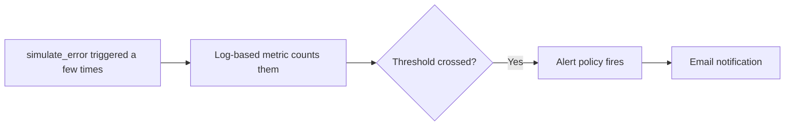

# 6. Alerts

## What Is It? (Plain English)

An alert policy watches a metric and proactively notifies you the moment it crosses a threshold you define — instead of you having to remember to go check.

## Why It Matters for AI Engineers

Everything in this module so far required *you* to go look. Alerts flip that around: you find out about a problem because GCP tells you, not because you happened to check the console. This is the actual payoff of everything wired up in topics 1-5.

## Key Concepts

| Term | Meaning |
|------|---------|
| **Log-Based Metric** | A metric derived by counting matching log entries — this topic counts the simulated error's log message |
| **Alert Policy** | The rule: which metric, what threshold, over what time window |
| **Notification Channel** | Where the alert actually gets sent — email, in this module's demo |
| **Evaluation Latency** | Real time it takes for an alert to notice a threshold was crossed and actually notify you — not instant |

## How It Fits Together



## Step-by-Step

**1. Create a log-based metric counting the simulated error.** This app calls `cloud_logging.Client().setup_logging()`, which routes `logging.error(...)` through *structured* Cloud Logging — the "simulated failure triggered on purpose" message lands in `jsonPayload.message`, not `textPayload` (`textPayload` is only the unhandled exception's own stderr traceback, a separate log entry). A `textPayload` filter here matches zero real entries and the alert would silently never fire — no error anywhere to point at why. Verify the real field first:
```bash
gcloud logging read 'resource.type=cloud_run_revision AND jsonPayload.message:"simulated failure"' --format=json --limit=5
```
Then create the metric against the field that's actually there:
```bat
gcloud logging metrics create digest_simulated_errors ^
  --description="Counts simulated digest-worker errors" ^
  --log-filter="resource.type=cloud_run_revision AND jsonPayload.message=\"simulated failure triggered on purpose\""
```

**2. Create a notification channel (email):**
```bat
gcloud alpha monitoring channels create ^
  --display-name="My Email" ^
  --type=email ^
  --channel-labels=email_address=%NOTIFICATION_EMAIL%
```

**3. Create the alert policy** (see `06_alert_policy.json` for the full definition — threshold of 1 occurrence, short evaluation window):
```bat
gcloud alpha monitoring policies create --policy-from-file=06_alert_policy.json
```

**4. Trigger it — call the error a couple of times:**
```bat
curl "%SERVICE_URL%/?simulate_error=true"
curl "%SERVICE_URL%/?simulate_error=true"
```

**5. Wait.** Genuinely — evaluation and notification both take real time, often a minute or two. Don't fake this part; it's an honest, useful thing to understand about how alerting actually behaves in production.

## Common Pitfalls

- Expecting instant notification — alerting has real latency baked into how it works; design your expectations (and your on-call processes) around that.
- Setting the threshold so low that everything alerts, or so high that real problems get missed — this demo deliberately uses a low threshold (1) purely to make the demo reliable, not as production guidance.
- Forgetting to actually trigger the condition when testing — an alert policy that's never been proven to fire is not a policy you can trust.
- Writing a log-based metric filter against `textPayload` for a message actually logged through Python's `logging` module with structured Cloud Logging enabled — check the real field (`jsonPayload.message` here) with `gcloud logging read` before building an alert on top of it, or it fires never, silently.

## Quick Recap

1. What does this topic's alert policy actually watch — the raw logs, or something derived from them?
2. Why shouldn't you expect an alert to notify you instantly?
3. Why is deliberately triggering a known problem the right way to test an alert policy?
